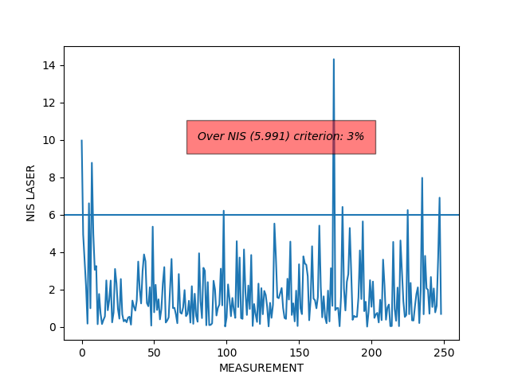
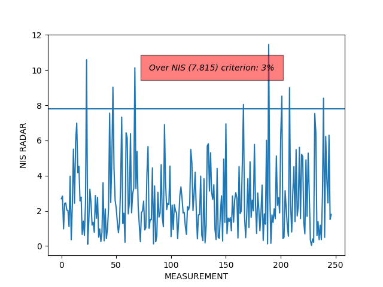

# Unscented Kalman Filter Project
Self-Driving Car Engineer Nanodegree Program

In this project utilize an Unscented Kalman Filter to estimate the state of a moving object of interest with noisy lidar and radar measurements. Passing the project requires obtaining RMSE values that are lower that the tolerance outlined in the project rubric. 

[image1]: ./writeup/nis_laser.png "NIS laser"
[image1]: ./writeup/nis_radar.png "NIS radar"

## Code
The #todo code sections were filled mostly by copying or slightly adapting the course material. Parameter initialzation and NIS text output was addionally introduced. I wrote a small python script in the writeup folder for NIS plotting and evaluation.

## Parameter Selection
- For process noise standard deviation longitudinal acceleration I chose std_a_ = 3m/s^2;
- For process noise standard deviation yaw acceleration I chose 1 rad/s^2

## Performance
With the parameters I chose I had the performance of 

RMSE Dataset 1
- X: 0.0849
- Y: 0.0842
- VX: 0.3115
- VY: 0.2020

RMSE Datset 2
- X: 0.0875
- Y: 0.0786
- VX: 0.3904
- VY: 0.2282

## NIS
When running NIS calculations on dataset 1 I get the following result

### Laser

### Radar
(For the radar I removed the first two entries for initialization purpose)

## NIS - Interpretation
It can be seen that the process noise parameter were choosen correctly because only in 3% (both radar and laser) of all measurement the NIS is over the 95% line. Meaning: The current setup has even the capability of handling more dynamic scenarios without underestimating the uncertainty of the model.

## Ideas for improvement
- The NIS for radar and laser was similar in this assignemnt. However if they differ it could be sense to apply individual process parameter depending on the sensor origin. Meaning the Predict step should check with it will apply the later Update step on laser or radar.

- The CTRV model performs well. However there might be other models suited even better, like the mentioned CTRA, CSAV, CCA etc.

- You can even think of a comination of these models with dynamic switching between them. See Multiple-Model Approach by X. Rong Li and Vesselin P. Jilkov. Resource: <http://citeseerx.ist.psu.edu/viewdoc/download?doi=10.1.1.61.8751&rep=rep1&type=pdf>
